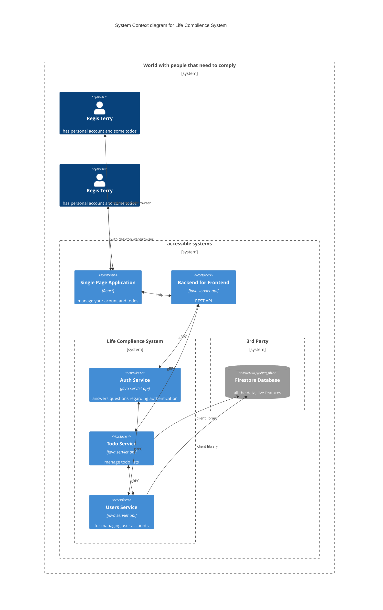

# todo-list-fullstack
example application to demonstrate test automation and ci/cd practices.

## overview

```mermaid
C4Context
    title System Context diagram for Life Complience System
    Boundary(b0, "World with people that need to comply") {
        Person(registered, "Regis Terry", "has personal account and some todos")     
        Person(unregistered, "Regis Terry", "has personal account and some todos")     
        Boundary(b1, "accessible systems") {
            Container(SPA, "Single Page Application", "React", "manage your acount and todos")
            Container(BFF, "Backend for Frontend", "java servlet api"," REST API")
            Boundary(b2, "Life Complience System") {
                Container(AUTH, "Auth Service", "java servlet api","answers questions regarding authentication")
                Container(TODO, "Todo Service", "java servlet api","manage todo lists")
                Container(USER, "Users Service", "java servlet api"," for managing user accounts")
            }
            Boundary(b3, "3rd Party") {
              SystemDb_Ext(DB, "Firestore Database", "all the data, live features")
            }
        }
    }
     
BiRel(registered, SPA, "with desktop webbrowser")
BiRel(unregistered, SPA, "with desktop webbrowser")
BiRel(SPA, BFF, "http")
BiRel(BFF, AUTH, "gRPC")
BiRel(BFF, TODO, "gRPC")
BiRel(TODO, USER, "gRPC")
BiRel(AUTH, USER, "gRPC")
Rel(TODO, DB, "client library")
Rel(USER, DB, "client library")

UpdateLayoutConfig($c4ShapeInRow="2", $c4BoundaryInRow="2")
    
```

## run
create the infrastructure with terraform:

