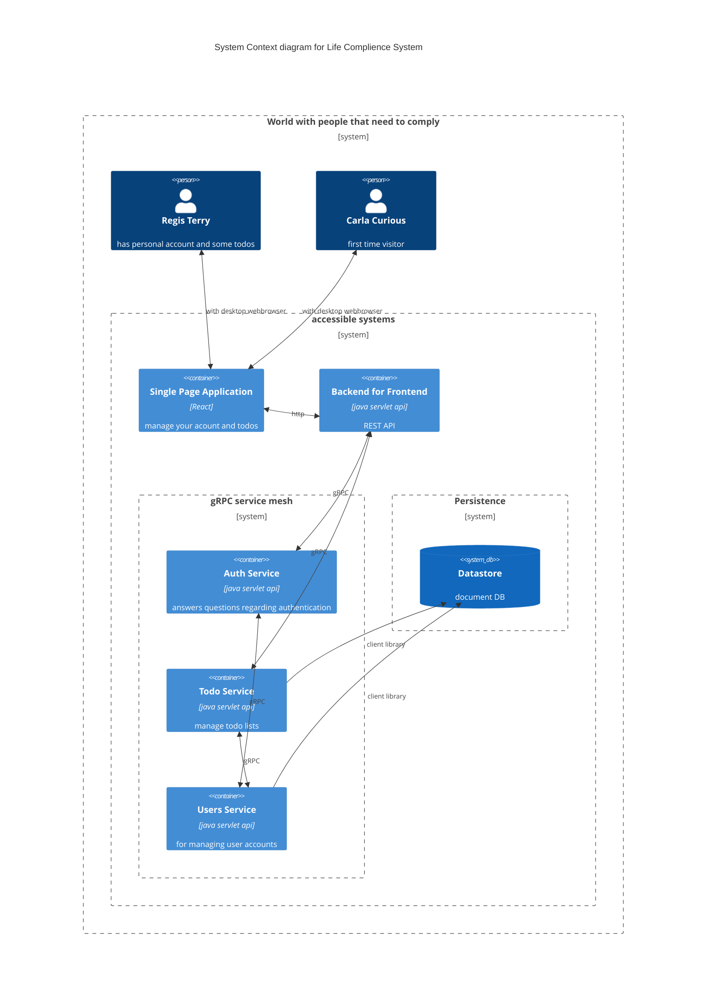

# todo-list-fullstack
example application to demonstrate test automation and ci/cd practices.

## overview



## get your own instance:
* fork this repository
* create GCP project, enable billing
* install gcloud and terraform
* login  `gcloud auth application-default login`
* create billing budget `gcloud alpha billing budgets create --billing-account=$your_billling_account --display-name="budget" --budget-amount=5.00EUR --threshold-rule=percent=0.70 --threshold-rule=percent=0.90,basis=forecasted-spend` this will notify you if for some reason you spend 
* go to `/terraform/production` and create a `terraform.tfvars` file, replace values with yours: 
``` 
location = "europe-west1"
notification_email = "email@example.com"
project_id= ${gcp_project_id}
repo_name = "todo-list-fullstack"
repo_owner = ${gihub_username}
zone = "europe-west1-d" 
```
* run terraform init and terraform apply (might require multiple tries first time for apis to be enabled). 
* `Error creating Trigger: googleapi: Error 400: Repository mapping does not exist. Please visit https://console.cloud.google.com/cloud-build/triggers/connect?project=... to connect a repository to your project` do that
* some images are not present yet, so you have to run all the deployment triggers to have the image built
* change and commit/push [.env](single-page-application/.env) to your actual bff url (go to cloud run to find it) FIXME, should be automatic
* Configure Error Reporting notifications by [going to the console](https://console.cloud.google.com/errors) and clicking "Configure Notifications". Unfortunately, [we're unable to automate this](https://github.com/hashicorp/terraform-provider-google/issues/12068).
* set error notification channel https://console.cloud.google.com/errors
