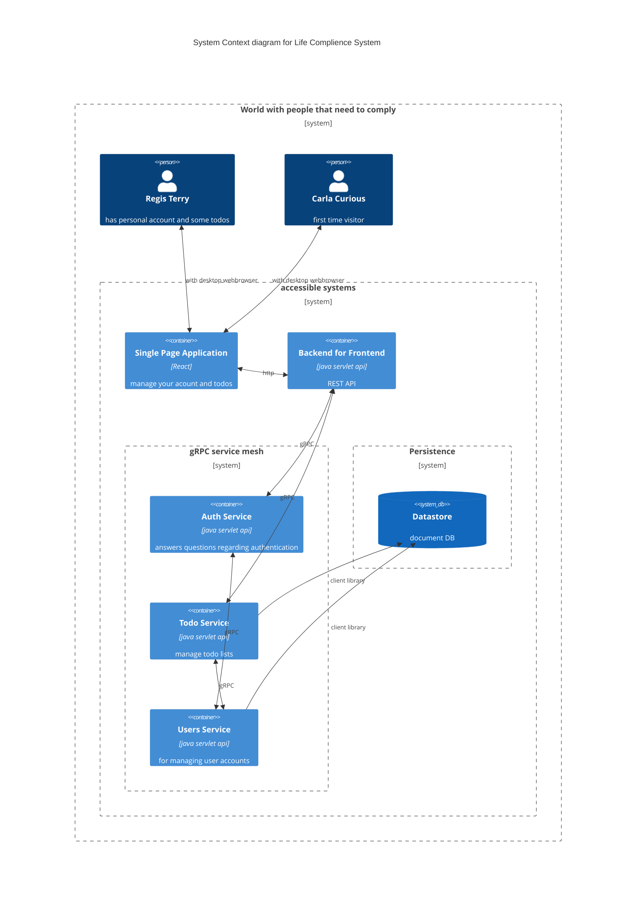

# todo-list-fullstack

example application to demonstrate test automation and ci/cd practices. playground to try out different frameworks and
more.

It's not only about code. For this to be more realistic, we don't develop without goal. This leads to some dissonance
between `this is a playground` and `this is product development` which shows in the vision, value, etc.

## vision

We want to know the what, why and how ToDo stuff. From personal experience, it seems that there is so much stuff you
have to do, be it daily routine, sudden issues, reoccurring obligations and then there is also the stuff you should do
but don't even know about. This is where `[product name]` comes in. We analyse your life holistically and with the help
of `[AI/ML/blockchain/...]` we will be able to not only tell you, what needs to be done, we also
deploy `[smart agents/replacable drones/underpaid workers]` to get it done for you. A truly digital personal assistant
to handle the tedious bits of adulting.

### Now

* gather user details
* MVP development
    * save/load list by name
    * auth with github account
* dogfooding

### Next

* suggest todos
* suggest ways to outsource resolution

### Later

* create a comprehensive plan of all the things a person or community has to do
* get it done automatically

## Risks

`ToDo`

## Test Strategy

`ToDo`: what's called a strategy here isn't really helping decision makeing, maybe it's more `principles`
or `things that sound good`

We test for 3 things:

* ensure and prove people can trust us
* learn about our users
* make the development experience best

Therefor we value:

* good engineering practices
* good user feedback loops
* automation of the things that should be automated
* collaboration
* diversity

Great looks like:

* 80/20 rule of test automation
* monitoring and data driven development instead of e2e tests
* paying attention to the DORA metrics
* make it easy for users to get good help and give feedback
* devs can pick the tools they like
* continously incorporate diverse expert feedback
* no persistent stages, all testing done locally, on ephemeral environments or in production
* the product is used by most of the staff privately or for working on this product

## Test Plan

| when       | what                           | who  | why             | precondition     | done                                                  |
|------------|--------------------------------|------|-----------------|------------------|-------------------------------------------------------|
| continuous | unit testing                   | dev  | TDD             | scenario context | good coverage, readable, running in CI and green      |
| continous  | integration                    | dev  | BDD             | discovery        | automated and green and/or confirmed on ephemeral env | 
| continous  | exploration                    | pair | share,diversity | product vision   | timeboxed                                             |
| continous  | smoke test                     | dev  | observability   | scenarios        | dashboard green                                       | 
| continous  | user observation and interview | dev  | diversity       | scenarios        | timeboxed                                             | 

`ToDo`: performance/security/accessibility/data/chaos

## Architecture


Currently, people interact with a browser based client that allows them to access a REST API that acts as a front to a service mesh. 

## repo structure
### [.google](.google): cloudbuild pipeline scripts


### [bff](bff): backend for frontend, REST API
BFF (Backend for Frontend), which is a way of designing the backend
(server) of an application to specifically meet the needs of the frontend (client) of that application. BFFs communicate with a set of backend services through an API gateway, and are designed to be lightweight and scalable.

### [bin](bin): convenience scripts for development
### [grpc](grpc): describes data and services from which code is generated to implement services and interact with these
gRPC is a high-performance Remote Procedure Call (RPC) framework that lets developers exchange data between microservices or applications efficiently and with low latency. It relies on a binary protocol called Protocol Buffers (protobufs) to describe message formats and interfaces, which helps reduce network round trips required for data exchange. gRPC provides both client-side and server-side libraries for multiple programming languages, and includes built-in support for load balancing, flow control, and congestion control.

### [report](report): library that parses junit test results and pushes them to google bigquery

### [single page application](single-page-application): frontend based on the famous ToDoMVC 
A single-page application (SPA) package is a software development tool that helps build web applications that load all their content on a single web page, instead of multiple pages from the server. This makes the user experience smoother and faster, with less need to refresh or reload data from the server. SPA packages use JavaScript to dynamically update content without needing to rely on server-side rendering. This project use React framework but SPA frameworks can also include Angular, and Vue.js

### [system tests](system-tests): end-to-end tests

Various frameworks for testing the whole system as mostly black box. Some frameworks may focus on http apis, others on browser interaction or mixture of both.


### [terraform](terraform): infrastructure as code 
Terraform is a tool used in infrastructure as code that helps teams define, create and manage their infrastructure using code. It allows users to easily and quickly make changes to infrastructure resources such as virtual machines, databases, and load balancers across multiple cloud providers. Terraform is highly interoperable, working with almost any cloud provider and supporting various infrastructure types.

### [todo service](terraform): microservice handling todo management
The todo-service package is a software development tool used to create a task management service. It provides an API that lets users create, read, update, and delete tasks. The package can be customized and integrated with various front-end frameworks to create full-featured task management applications. Document full-stack project 6 The todo-service package may also include features such as task prioritization, deadlines, tags, user access control, and notifications.

## get your own instance:

* fork this repository
* create GCP project, enable billing
* install gcloud and terraform
* login  `gcloud auth application-default login`
* create billing
  budget `gcloud alpha billing budgets create --billing-account=$your_billling_account --display-name="budget" --budget-amount=5.00EUR --threshold-rule=percent=0.70 --threshold-rule=percent=0.90,basis=forecasted-spend`
  this will notify you if for some reason you spend
* go to `/terraform/production` and create a `terraform.tfvars` file, replace values with yours:

``` 
location = "europe-west1"
notification_email = "email@example.com"
project_id= ${gcp_project_id}
repo_name = "todo-list-fullstack"
repo_owner = ${gihub_username}
zone = "europe-west1-d" 
```

* run terraform init and terraform apply (might require multiple tries first time for apis to be enabled).
* `Error creating Trigger: googleapi: Error 400: Repository mapping does not exist. Please visit https://console.cloud.google.com/cloud-build/triggers/connect?project=... to connect a repository to your project`
  do that
* some images are not present yet, so you have to run all the deployment triggers to have the image built
* change and commit/push [.env](single-page-application/.env) to your actual bff url (go to cloud run to find it) FIXME,
  should be automatic
* Configure Error Reporting notifications by [going to the console](https://console.cloud.google.com/errors) and
  clicking "Configure Notifications".
  Unfortunately, [we're unable to automate this](https://github.com/hashicorp/terraform-provider-google/issues/12068).
* set error notification channel https://console.cloud.google.com/errors

## dev

### docker

run everything locally with `docker compose`

```shell
git clone git@github.com:globalworming/todo-list-fullstack.git
cd todo-list-fullstack/
docker compose -f docker-compose.local.yml up
```

open `localhost:3000`

### test
there is a [run all tests](bin/runAllTests.sh) script. make sure everything on port 8000 and 3000 is shut down `ToDo: script should check that`
```
Usage: bash runAllTests.sh [-t] [-s "${stage}"]
  stage defaults to local
  -t is for pushing to bigquery, you need the right credentials for that
```


